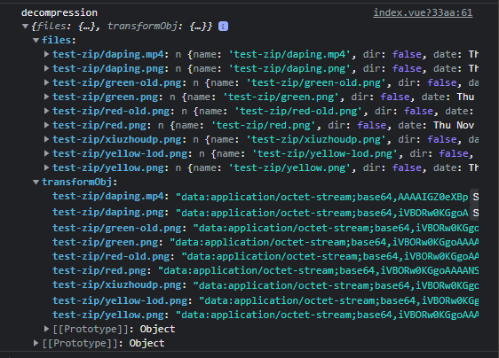

# 文件操作

下载依赖

`npm i hsja-utils `

## 压缩图片

- @param{file} file 需要压缩的图片文件
- @param{Number, Array} scale 压缩倍数，默认**0.5**

  - 支持和encoderOptions一样的范围段传参
    ```javascript
    compressImg(
      file,
      scale = [
        { key: '(-,1)', value: 0.5 }, // <= 1，压缩0.5倍, "()"不包含等于号，"[]"包含等于号
        { key: '[1,2]', value: 0.4 }, // >1 && <= 2，压缩0.4倍
        { key: '(2,+)', value: 0.2 }, // >2 ，压缩0.2倍
      ],
      encoderOptions = 0.92
    )
    ```
- @param{Number, Array} encoderOptions 压缩质量，默认

  ```javascript
  [
    { key:'(-,1)', value:1 },
    { key:'[1,2]', value:0.92 },
    { key:'(2,+)', value:0.5 },
  ]
  ```

  - 同时也支持数值传参，代表所有大小的图片压缩都是一样的值
- @return{file} 返回文件

```javascript
import { compressImg } from 'hsja-utils'
async handleChange(file) {
      console.log('file', file) // 当前文件size大小：1609194
      const afterFile = await compressImg(file.raw)
      console.log('afterFile', afterFile) // 0.5 压缩后size大小：407784
      const read = new FileReader()
      read.readAsDataURL(afterFile)
      read.onload = (e) => {
        const img = new Image()
        // 允许资源跨域使用
        img.setAttribute('crossOrigin', 'anonymous')
        img.src = e.target.result
        this.imageUrl = img.src
      }
}
```

## 解压zip包

- @param{file} file 需要解压的zip码流
- @param{string} str 解压格式：
  - 不传 --- 返回对应文件流；blob --- 返回blob格式数据；img-base64 --- 返回图片base64
- @return{object} 返回

```javascript
import { decompression } from 'hsja-utils'
// 获取zip包数据，得到码流，业务自己调接口
const file = await axios.get('/test-zip.zip', { responseType: 'blob' })
console.log('file', file)
const files = await decompression(file, 'img-bas64') // 通过工具函数获取需要的数据格式
console.log('decompression', files)
```



## 下载文件码流

一般用于后端接口返回二进制码流，然后下载

**注：**如果要用后端的文件名字，response header中的 `content-disposition `值一定是 `attachment;filename=后面加文件名，方法中用于切割string，不然会得到undefined.xslx`，因为 `attachment;filename=`是后端代码自己加上去的，写法会很多，要统一

```javascript
// 接口中记得加responseType: 'blob'
import { downloadFile } from 'hsja-utils'
downloadFile(res, fileName)
downloadFile(res) // 不传fileName，默认使用后端headers中给的filename的值
```

## 下载文件通过url

主要用于前端或者后端存储的静态文件的下载

**注：**按钮不能使用a标签，使用button按钮要阻止按钮的默认行为

```javascript
import { downloadFileByUrl } from 'hsja-utils'
downloadFileByUrl(str, fileName)
// downloadFileByUrl(`${ViteApiUrl}/shouye-ppt.pptx`, '住建局ppt.pptx')
```
